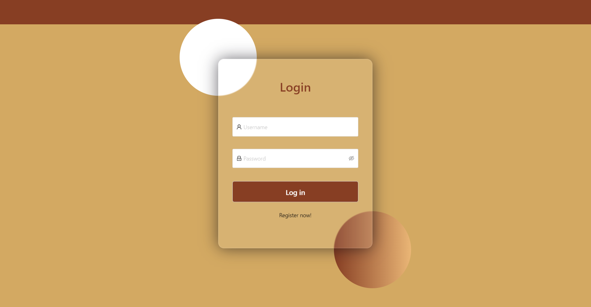
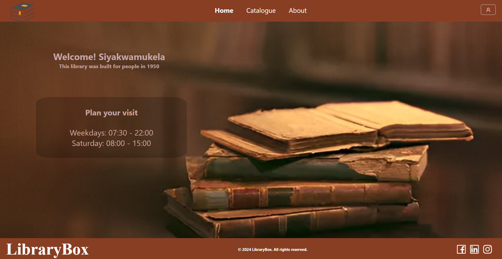
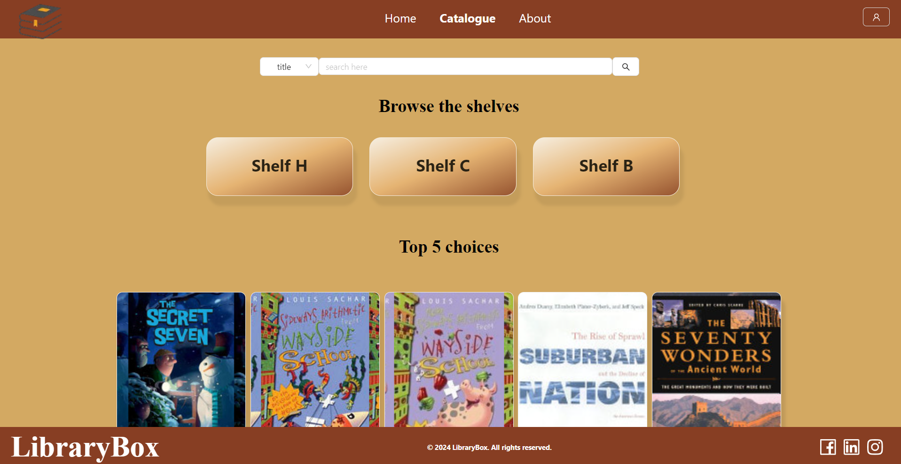
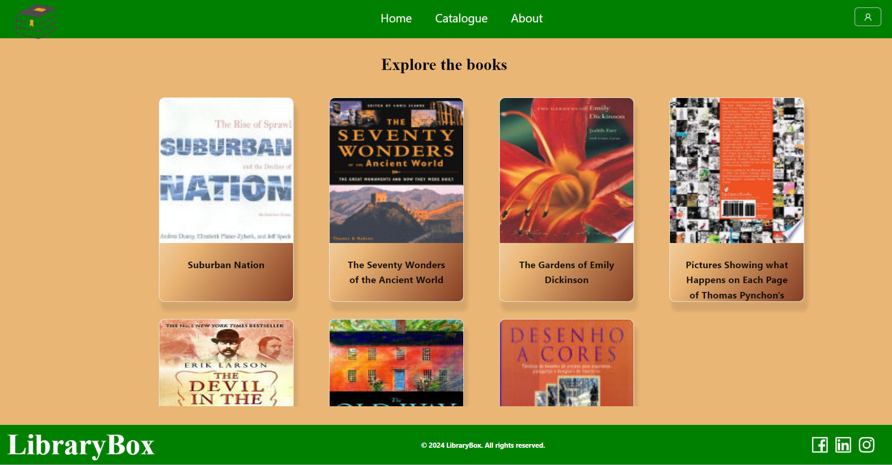
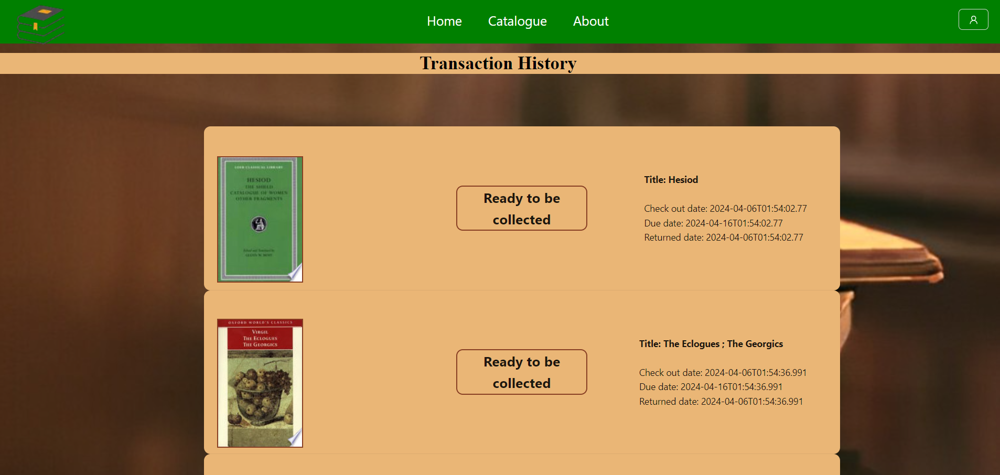
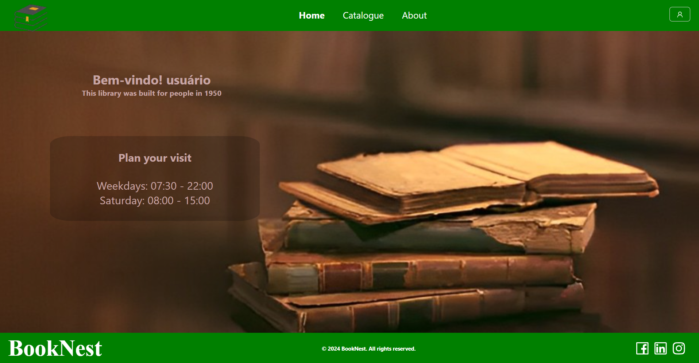

# <em>LibraryBox</em> Client

## What does the app do?

This is a Library System designed for users. Within the system, users have the ability to browse books available on the shelves and borrow them. Additionally, users can view their borrowing history. Moreover, users have the option to search for specific books using the search bar if they know exactly what they are looking for.

This project was bootstrapped with: npx create-next-app@latest

## Available Scripts

In The Project directory, you can run:

### `npm run dev`

Runs the app in the development mode.\
Open [http://localhost:3000](http://localhost:3000) to view it in your browser.

---

## Admin App Screenshots

  
<em>Login</em>

  
<em>Landing Page</em>

  
<em>Catalog</em>

  
<em>Explore Books Page</em>

  
<em>Profile Drawer</em>

  
<em>History</em>

  
<em>The configured app with a different name and color</em>

